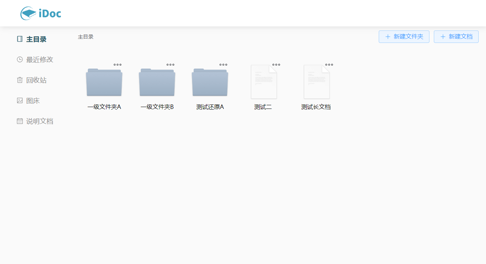

# README

## 简介

团队共享文档



## 实现功能

- 文件夹/文件列表
- md文档预览
- md文档编辑
- 最近浏览文件
- 文件/文件夹删除/还原
- 图床（图片上传/预览/删除）

## 功能说明

### 主目录

- 创建文件夹/文件：点击按钮按照提示创建即可
- 点击图标右上角的省略号，在菜单中可进行重命名和删除操作
- 双击文件夹后进入下一级目录
- 如进入多层子目录，可添加上方的面包屑导航进行跳转
- 双击文件进入文档编辑器

### 文档查看/编辑

系统使用的 Markdown 文档，Markdown 是一种轻量级标记语言，使用方便且格式清晰，具体语法规则可以参考：[Markdown 官方教程](https://markdown.com.cn/basic-syntax/)

#### 基本功能

- 双击文件后默认进入预览模式，点击右上角“编辑”按钮进入编辑模式
-  编辑模式中可通过菜单栏进行各种操作，例如：查看大纲、插入emoji表情、加粗倾斜、插入列表、插入引用块、插入代码块、插入图片、全屏编辑以及切换模式等

#### 插入图片

文档配置了图片上传接口，在文档中插入的图片将保存在服务器目录中，并返回对应的url连接，注意由于markdown语法本身并不支持对于图片进行缩放、居中等操作，所以如有此需求需要借助`` 标签，代码如下：

```

```

其中：

- `display:block;` 设置块级显示，如果需要居中，则必写
- width/height 控制宽度或高度，建议只使用一个，另一个属性自动放缩
- `margin:auto;`控制图片居中

也可以通过“图床”功能上传图片后将url贴在文档中使用

#### 表格

文档编辑器默认进入”及时渲染“模式，此时通过菜单栏插入表格是固定的，如果需要创建自定义行列的表格，有两种方法：

- 在菜单栏中找到“切换编辑模式”，切换为“所见即所得”模式，此时插入表格后鼠标指针放在表格上会有更详细的菜单栏
- 切换为“分屏预览”模式，此时在左侧插入创建表格代码：

```
|title1|title2|title3| 
|----|----|----|
|aaa|bbb|ccc|
|ddd|ddd|ddd|
```

上述代码中第一行控制表格标头，第二行为固定写法，之后行为表格内容

#### 多人查看文档

由于系统没有加入用户系统，因此会存在多人同时打开一个文档的情况，这里的处理方法是为每个文件建立一个文件锁，如果用户A编辑某个文档，该文档会处理锁定状态，其他用户可以查看，但不可编辑

此外，在网站内进行跳转时，文档会自动保存，解锁，但仍然推荐编辑完成后手动进行保存上传。如果强制关闭页面（例如直接关闭浏览器，此时会弹出提醒），并且文档没有保存，那么该文档会永久处于锁定（浏览器强制关闭无法发送保存请求），需修改数据库解锁文档

### 最近修改

此页面会列出最近修改的5个文档，可更方便查看近期文档

### 回收站

初次删除的文件会在回收站区域显示，提供两个功能：

- 还原：注意还原文件夹的时候会自动恢复所有子文件/子文件夹，如果其父文件夹也被删除，会自动将父文件夹还原
- 彻底删除：无法还原

### 图床

为了方便在文档中插入图片，这里提供了图床功能，上传图片后会返回该图片的url链接，也可以通过下方的预览进行大图查看或者删除该图片

## 技术栈

Vite + Vue3 + Pinia + Node.js + MongoDB

## 项目主要结构

- iDoc
  - idoc-server：服务器端代码
    - dboper：mongodb shcema、model等
    - imgs：静态资源文件夹，保存上传的图片资源
    - server.js：服务器路由
  - src：前端项目界面代码
    - assets：静态资源
    - request：axios封装
    - router：路由配置
    - store：pinia配置
    - main.js：入口文件

## 开发与部署

### 前端

1. 进入项目文件夹执行`npm install`安装依赖
2. 使用`npm run dev`启动项目（开发模式）
3. 使用`npm run build`打包发布项目（生产模式）

### 后端

1. 进入项目`idoc-server`目录
2. 使用`node ./server.js` 启动（需要对实际的ip、端口以及保存路径等做实际配置）


## 数据库collection结构

| 字段             | 类型         | 描述                                                  |
| ---------------- | ------------ | ----------------------------------------------------- |
| _id              | ObjectID     | 文件/文件夹ID                                         |
| name             | String       | 文件/文件夹名                                         |
| type             | String       | 类型，标志文件或文件夹 `['dir', 'md']`                |
| alterTime        | Date         | 文件/文件夹最近修改日期                               |
| isDelete         | Boolean      | 标志文件/文件夹本身是否被删除（回收站功能使用）       |
| isAncestorDelete | Boolean      | 标志文件/文件夹祖先是否有被删除的（最近浏览功能使用） |
| lock             | Boolean      | 标志文件是否上锁                                      |
| file             | String       | 文件内容                                              |
| parent           | String       | 直接父元素ID                                          |
| ancestors        | List(String) | 祖先数组                                              |


## 数据接口

基础路径：`http://192.168.10.15:8092`

### 1.获取所有的文件/文件夹

**描述：**

- 获取某一文件夹下所有的文件/文件夹列表

**请求类型：**

- POST

**请求URL：**

- `/getall`

**请求体：**

| 参数名 | 类型            | 描述       |
| ------ | --------------- | ---------- |
| parent | String/ObjectID | 父文件夹ID |

**返回示例：**

```
{
 status: '200',
 message: '返回文件/文件夹信息',
 data: [document1, document2...]
}
```

**返回参数说明：**

| 参数   | 类型   | 描述                             |
| ------ | ------ | -------------------------------- |
| status | String | 200表示返回成功，205表示获取失败 |
| data   | List   | 文件/文件列表                    |


### 2.获取最近编辑的文档

**描述：**

- 获取最近编辑的前5个文档（目前文档只有md类型）

**请求类型：**

- GET

**请求URL：**

- `/getrecentfiles`

**请求体：**

| 参数名 | 类型 | 描述 |
| ------ | ---- | ---- |
|        |      |      |

**返回示例：**

```
{
 status: '200',
 message: '返回文件/文件夹信息',
 data: [document1, document2...]
}
```

**返回参数说明：**

| 参数   | 类型   | 描述                             |
| ------ | ------ | -------------------------------- |
| status | String | 200表示返回成功，205表示获取失败 |
| data   | List   | 文件/文件列表                    |


### 3.获取所有的删除的文件/文件夹

**描述：**

- 获取所有被标记为删除的文件/文件夹（isDelete为true）

**请求类型：**

- GET

**请求URL：**

- `/getdeletedfiles`

**请求体：**

| 参数名 | 类型 | 描述 |
| ------ | ---- | ---- |
|        |      |      |

**返回示例：**

```
{
 status: '200',
 message: '返回文件/文件夹信息',
 data: [document1, document2...]
}
```

**返回参数说明：**

| 参数   | 类型   | 描述                             |
| ------ | ------ | -------------------------------- |
| status | String | 200表示返回成功，205表示返回失败 |
| data   | List   | 文件/文件列表                    |


### 4.获取祖先数组

**描述：**

- 获取某一文件夹/文件的祖先数组

**请求类型：**

- POST

**请求URL：**

- `/getancestors`

**请求体：**

| 参数名 | 类型            | 描述          |
| ------ | --------------- | ------------- |
| id     | String/ObjectID | 文件/文件夹ID |

**返回示例：**

```
{
 status: '200',
 message: '返回祖先信息',
 data: []
}
```

**返回参数说明：**

| 参数   | 类型   | 描述                             |
| ------ | ------ | -------------------------------- |
| status | String | 200表示返回成功，205表示返回失败 |
| data   | List   | 祖先数组                         |

### 5.获取文件/文件夹名

**描述：**

- 根据ID获取文件或文件夹的ID

**请求类型：**

- POST

**请求URL：**

- `/getname`

**请求体：**

| 参数名 | 类型            | 描述          |
| ------ | --------------- | ------------- |
| id     | String/ObjectID | 文件/文件夹ID |

**返回示例：**

```
{
 status: '200',
 message: '返回文件/文件夹信息',
 data: [{_id, name}]
}
```

**返回参数说明：**

| 参数   | 类型   | 描述                             |
| ------ | ------ | -------------------------------- |
| status | String | 200表示返回成功，205表示返回失败 |
| data   | Object | 文件/文件夹名                    |

### 6.添加文件夹

**描述：**

- 创建文件夹

**请求类型：**

- POST

**请求URL：**

- `/adddir`

**请求体：**

| 参数名    | 类型            | 描述       |
| --------- | --------------- | ---------- |
| parent    | String/ObjectID | 父文件夹ID |
| name      | String          | 文件夹名   |
| ancestors | List            | 祖先数组   |

**返回示例：**

```
{
 status: '200',
 message: '文件夹创建成功',
}
```

**返回参数说明：**

| 参数   | 类型   | 描述                                                    |
| ------ | ------ | ------------------------------------------------------- |
| status | String | 200表示创建成功，204表示存在同名文件夹，205表示创建失败 |


### 6.添加文件

**描述：**

- 创建文档（目前只支持md文档）

**请求类型：**

- POST

**请求URL：**

- `/addfile`

**请求体：**

| 参数名    | 类型            | 描述               |
| --------- | --------------- | ------------------ |
| parent    | String/ObjectID | 父文件夹ID         |
| name      | String          | 文件名             |
| type      | String          | 目前只有`'md'`类型 |
| file      | String          | 文件内容           |
| ancestors | List            | 祖先数组           |

**返回示例：**

```
{
 status: '200',
 message: '文件创建成功',
}
```

**返回参数说明：**

| 参数   | 类型   | 描述                                                    |
| ------ | ------ | ------------------------------------------------------- |
| status | String | 200表示创建成功，204表示存在同名文件夹，205表示创建失败 |

### 7.删除文件夹

**描述：**

- 删除文件夹
  - 将文件夹本身 isDelete字段置为true
  - 所有子文件/子文件夹的 isAncestorDelete字段置为true

**请求类型：**

- POST

**请求URL：**

- `/deldir`

**请求体：**

| 参数名 | 类型            | 描述     |
| ------ | --------------- | -------- |
| id     | String/ObjectID | 文件夹ID |

**返回示例：**

```
{
 status: '200',
 message: '文件夹删除成功',
}
```

**返回参数说明：**

| 参数   | 类型   | 描述                             |
| ------ | ------ | -------------------------------- |
| status | String | 200表示删除成功，205表示删除失败 |


### 8.删除文件

**描述：**

- 删除文件
  - 将文件 isDelete字段和 isAncestorDelete字段置为true

**请求类型：**

- POST

**请求URL：**

- `/delfile`

**请求体：**

| 参数名 | 类型            | 描述     |
| ------ | --------------- | -------- |
| id     | String/ObjectID | 文件夹ID |

**返回示例：**

```
{
 status: '200',
 message: '文件删除成功',
}
```

**返回参数说明：**

| 参数   | 类型   | 描述                             |
| ------ | ------ | -------------------------------- |
| status | String | 200表示删除成功，205表示删除失败 |


### 9.彻底删除文件/文件夹

**描述：**

- 彻底删除文件/文件夹
- 删除文件夹时会递归删除其子文件/文件夹

**请求类型：**

- POST

**请求URL：**

- `/removefile`

**请求体：**

| 参数名 | 类型            | 描述     |
| ------ | --------------- | -------- |
| id     | String/ObjectID | 文件夹ID |

**返回示例：**

```
{
 status: '200',
 message: '移除成功',
}
```

**返回参数说明：**

| 参数   | 类型   | 描述                               |
| ------ | ------ | ---------------------------------- |
| status | String | 200表示删移除成功，205表示移除失败 |


### 10.还原文件/文件夹

**描述：**

- 还原删除的文件或者文件夹
- 还原时文件夹以及后代元素的isDelete和isAncestorDelete都会置为false

**请求类型：**

- POST

**请求URL：**

- `/restorefile`

**请求体：**

| 参数名 | 类型            | 描述          |
| ------ | --------------- | ------------- |
| id     | String/ObjectID | 文件/文件夹ID |

**返回示例：**

```
{
 status: '200',
 message: '还原成功',
}
```

**返回参数说明：**

| 参数   | 类型   | 描述                             |
| ------ | ------ | -------------------------------- |
| status | String | 200表示还原成功，205表示还原失败 |


### 11.重命名文件/文件夹

**描述：**

- 文件或文件夹重命名
- 先判断父文件夹下是否重名，再修改

**请求类型：**

- POST

**请求URL：**

- `/rename`

**请求体：**

| 参数名  | 类型            | 描述          |
| ------- | --------------- | ------------- |
| id      | String/ObjectID | 文件/文件夹ID |
| parent  | String/ObjectID | 文件夹ID      |
| newname | String          | 新名          |

**返回示例：**

```
{
 status: '200',
 message: '文件名修改成功',
}
```

**返回参数说明：**

| 参数   | 类型   | 描述                                                |
| ------ | ------ | --------------------------------------------------- |
| status | String | 200表示修改成功，204表示存在同名，205表示重命名失败 |


### 12.获取文件内容

**描述：**

- 获取md文档内容

**请求类型：**

- POST

**请求URL：**

- `/getfile`

**请求体：**

| 参数名 | 类型            | 描述   |
| ------ | --------------- | ------ |
| id     | String/ObjectID | 文件ID |

**返回示例：**

```
{
 status: '200',
 message: '返回文件内容',
 data:[{_id, file}]
}
```

**返回参数说明：**

| 参数   | 类型   | 描述                                 |
| ------ | ------ | ------------------------------------ |
| status | String | 200表示成功返回，205表示返回内容失败 |


### 13.保存文件内容

**描述：**

- 保存文件内容（目前只有md文档）

**请求类型：**

- POST

**请求URL：**

- `/savefile`

**请求体：**

| 参数名 | 类型            | 描述   |
| ------ | --------------- | ------ |
| id     | String/ObjectID | 文件ID |

**返回示例：**

```
{
 status: '200',
 message: '文件保存成功',
}
```

**返回参数说明：**

| 参数   | 类型   | 描述                                                |
| ------ | ------ | --------------------------------------------------- |
| status | String | 200表示保存成功，204表示文件不存在，205表示保存失败 |


### 14.图片上传

**描述：**

- 上传图片至静态资源目录，并返回url

**请求类型：**

- POST

**请求URL：**

- `/uploadimg`

**请求体：**

| 参数名     | 类型 | 描述       |
| ---------- | ---- | ---------- |
| uploadFile | file | 上传的文件 |

**返回示例：**

```
{
 status: '200',
 message: '图片上传成功',
 succMap: {filename, url}
}
```

**返回参数说明：**

| 参数    | 类型   | 描述                             |
| ------- | ------ | -------------------------------- |
| status  | String | 200表示长传成功，204表示上传失败 |
| succMap | Object | {filename: url}                  |


### 15.获取所有图片的连接

**描述：**

- 返回静态资源目录下所有的图片链接

**请求类型：**

- GET

**请求URL：**

- `/getimgurls`

**请求体：**

| 参数名 | 类型 | 描述 |
| ------ | ---- | ---- |
|        |      |      |

**返回示例：**

```
{
 status: '200',
 message: '获取图片列表成功',
 data: []
}
```

**返回参数说明：**

| 参数   | 类型   | 描述                             |
| ------ | ------ | -------------------------------- |
| status | String | 200表示长传成功，204表示上传失败 |
| data   | List   | url列表                          |


### 16.删除图片

**描述：**

- 删除图片

**请求类型：**

- POST

**请求URL：**

- `/delimg`

**请求体：**

| 参数名   | 类型   | 描述   |
| -------- | ------ | ------ |
| filename | String | 文件名 |

**返回示例：**

```
{
 status: '200',
 message: '图片删除成功',
}
```

**返回参数说明：**

| 参数   | 类型   | 描述                         |
| ------ | ------ | ---------------------------- |
| status | String | 200表示删除成功，205表示删除 |


### 17.返回文件锁状态

**描述：**

- 返回文件锁状态

**请求类型：**

- POST

**请求URL：**

- `/checklock`

**请求体：**

| 参数名 | 类型            | 描述   |
| ------ | --------------- | ------ |
| id     | String/ObjectID | 文件ID |

**返回示例：**

```
{
 status: '200',
 message: '获取文件锁状态',
 data: {_id, lock}
}
```

**返回参数说明：**

| 参数   | 类型   | 描述                             |
| ------ | ------ | -------------------------------- |
| status | String | 200表示长传成功，204表示上传失败 |
| data   | Object | lock状态 true or false           |


### 18.文件上锁

**描述：**

- 锁定文件（lock字段置为true）

**请求类型：**

- POST

**请求URL：**

- `/lockfile`

**请求体：**

| 参数名 | 类型            | 描述   |
| ------ | --------------- | ------ |
| id     | String/ObjectID | 文件ID |

**返回示例：**

```
{
 status: '200',
 message: '文件锁定成功',
}
```

**返回参数说明：**

| 参数   | 类型   | 描述                             |
| ------ | ------ | -------------------------------- |
| status | String | 200表示锁定成功，205表示锁定失败 |

### 19.文件解锁

**描述：**

- 解锁文件（lock字段置为false）

**请求类型：**

- POST

**请求URL：**

- `/unlockfile`

**请求体：**

| 参数名 | 类型            | 描述   |
| ------ | --------------- | ------ |
| id     | String/ObjectID | 文件ID |

**返回示例：**

```
{
 status: '200',
 message: '文件解锁成功',
}
```

**返回参数说明：**

| 参数   | 类型   | 描述                             |
| ------ | ------ | -------------------------------- |
| status | String | 200表示解锁成功，205表示解锁失败 |


